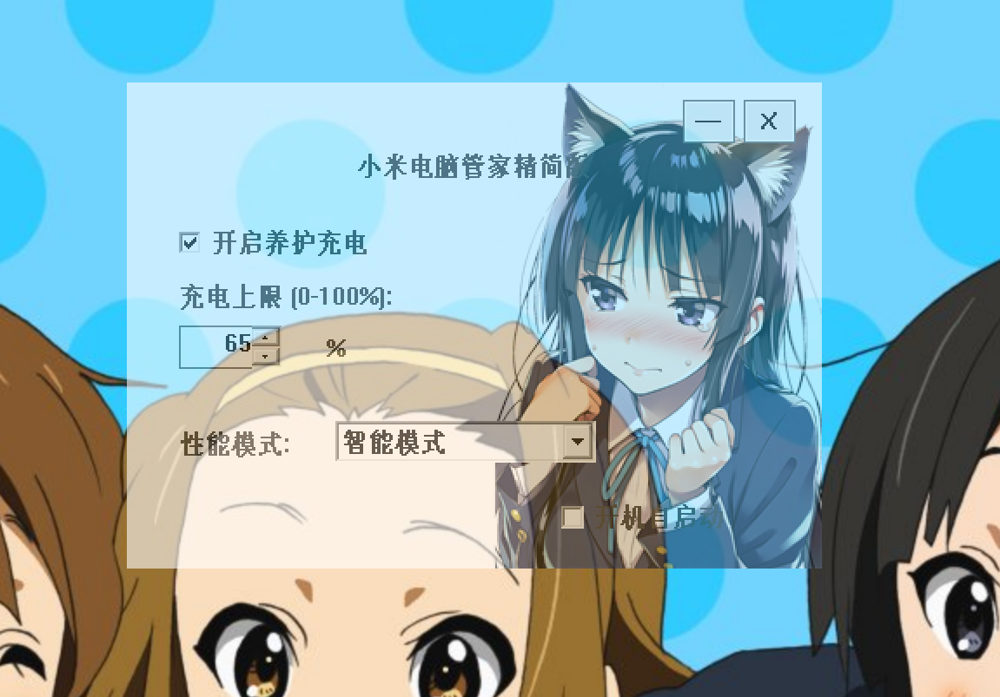

# Xiaomi PC Manager Lite (小米电脑管家精简版)
[English Version readme](README_en.md)

**仅在Redmibook Pro 14 2025 Ultra 7 255H 32+1T版本上进行测试，其他版本使用前请自行验证**
[B站专栏介绍](https://www.bilibili.com/opus/1085397596488335361)

## 简介
Xiaomi PC Manager Lite 是一个为小米笔记本电脑设计的轻量级 Windows 工具，支持电池养护充电、性能模式切换、全局快捷键、托盘操作及自启动等功能。

pixiv ID: 127323669

## 主要功能
- 养护充电开关及充电上限设置（支持快捷键）
- 性能模式切换（支持快捷键和自定义模式切换）
- 托盘图标与菜单，支持最小化到托盘
- 开机自启动选项
- 窗口半透明美化、可拖动、控件透明

## 快捷键
- `Ctrl+Alt+B`：开启/关闭养护充电
- `Ctrl+Alt+P`：切换到自定义性能模式，再次按下切回原性能模式

## 构建与运行
1. 依赖：
   - Windows 10/11
   - Visual Studio 2017 及以上
   - WinRing0 驱动（WinRing0x64.dll/WinRing0.dll，需放在程序目录）
2. 编译：
   - 打开解决方案，编译 `xiaomi_pc_manager_lite` 项目
3. 运行：
   - 以管理员权限运行（WinRing0 需要）

## 注意事项
- 仅支持部分小米笔记本型号（需支持相关 EC 寄存器）。
- 需以管理员权限运行，否则无法访问硬件接口。
- WinRing0 驱动版权归 OpenLibSys.org 所有。

## 致谢
- [WinRing0](http://openlibsys.org/)（硬件访问驱动，BSD License）

## 作者
- CHHHHHHEN

## License
- 仅供学习与个人使用，禁止商业用途。
