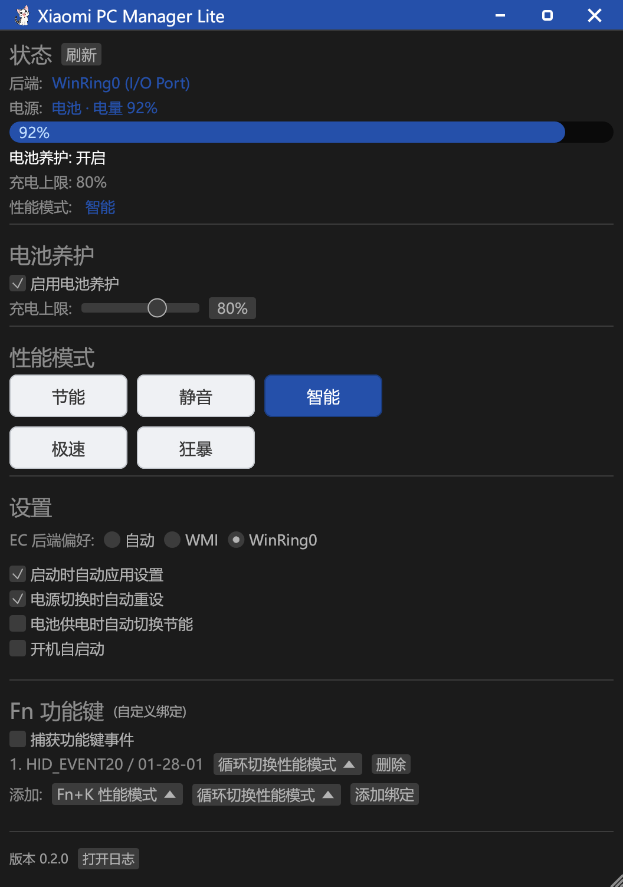

# Xiaomi PC Manager Lite

轻量级小米 PC 管理工具 — 电池养护 / 性能模式切换



## 主要功能

WinRing0 和 WMI 双控制后端，两者功能基本相同。

- 设置最大充电水平，开启或者关闭充电保护功能
- 切换风扇策略 Eco/Quiet/Smart/Fast/Extreme
- Fn 功能键自定义绑定（如 Fn+K 循环切换性能模式，可在设置中重新绑定）
- 托盘快捷操作：右键直接切换电池养护 / 选择性能模式，悬停实时显示状态与电量
- 电源智能管理：拔电自动切节能模式（可关），休眠唤醒自动重设设置
- 窗口隐藏到托盘后命令即时生效，状态变化（性能/养护）弹托盘通知

应用图标来源为项目根目录 `chi.png`（透明背景）：构建期由 `icons/icon.png`
（512×512）与 `icons/tray_icon.ico`（16/32/48/256 多帧）承载，任务栏/窗口/
标题栏/托盘/exe 图标统一使用该图像。

## 构建

```bash
# 类型检查
cargo check

# 构建
cargo build

# 发布构建
cargo build --release

# 运行
cargo run
```

## 代码结构

```
src/
├── main.rs         # 入口：初始化后端 → 加载配置 → GUI
├── command.rs      # 共享命令枚举 (UiCommand)
├── embed.rs        # WinRing0 DLL/SYS 运行时提取
├── startup.rs      # 后端初始化 + 启动配置应用
├── util.rs         # 通用工具（日志路径、WideString 等）
├── ec/             # 硬件访问层 (Hardware Abstraction Layer)
│   ├── mod.rs      # EC 寄存器地址常量
│   ├── backend.rs  # EcBackend trait + 工厂函数
│   ├── winring0.rs # WinRing0 后端 (I/O Port)
│   ├── wmi.rs      # WMI 后端 (MICommonInterface)
│   ├── wmi_util.rs # WMI 连接/查询工具
│   ├── battery.rs  # 充电上限映射 + 应用逻辑
│   ├── performance.rs # 性能模式枚举
│   ├── limits.rs   # 充电限值校验
│   ├── config.rs   # 配置序列化 (TOML)
│   ├── error.rs    # 错误枚举
│   ├── mock.rs     # 测试用后端模拟
│   └── fnkey.rs    # Fn 功能键 WMI 事件监听 + 自定义绑定
├── gui/            # 图形界面
│   ├── app.rs      # 主应用结构 + eframe 入口
│   ├── commands.rs # 命令处理 + 状态管理
│   └── view.rs     # UI 渲染
├── platform/       # Windows 平台集成
│   ├── mod.rs
│   ├── window.rs   # 主窗口显示控制（托盘隐藏/显示）
│   ├── power.rs    # 电源/电量快照
│   ├── autostart.rs    # 开机自启动（计划任务）
│   ├── privilege.rs    # 管理员提权
│   └── single_instance.rs # 单实例保护
└── tray/           # 系统托盘 + 消息泵
    ├── message_window.rs # 隐藏消息窗口（热键/托盘/电源广播）
    └── worker.rs   # 托盘图标 + 全局热键 + 电源事件
```
