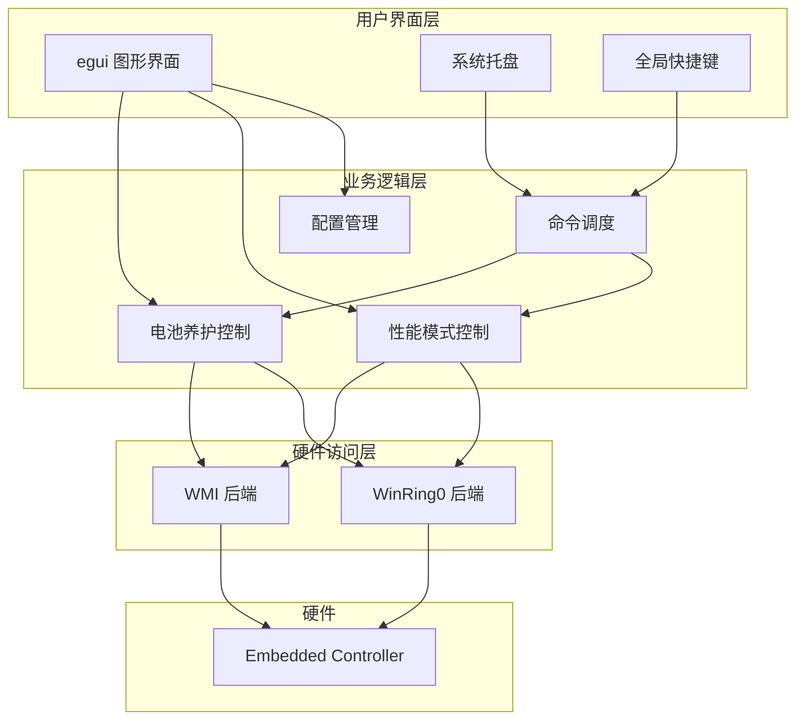

# 软件需求规格说明书

## Xiaomi PC Manager Lite

| 文档版本 | 1.0 |
|---------|-----|
| 产品版本 | 0.2.0 |
| 制定日期 | 2026-06-15 |
| 制定人 | opencode |

---

## 修订记录

| 版本 | 日期 | 描述 | 作者 |
|------|------|------|------|
| 1.0 | 2026-06-15 | 初始草案 | opencode |

---

## 目录

- [1. 引言](#1-引言)
  - [1.1 目的](#11-目的)
  - [1.2 范围](#12-范围)
  - [1.3 定义、首字母缩写和缩略语](#13-定义首字母缩写和缩略语)
  - [1.4 参考文献](#14-参考文献)
- [2. 总体描述](#2-总体描述)
  - [2.1 产品背景](#21-产品背景)
  - [2.2 产品功能概述](#22-产品功能概述)
  - [2.3 用户特征](#23-用户特征)
  - [2.4 假设与依赖](#24-假设与依赖)
  - [2.5 约束](#25-约束)
- [3. 功能需求](#3-功能需求)
  - [3.1 电池养护管理](#31-电池养护管理)
  - [3.2 性能模式切换](#32-性能模式切换)
  - [3.3 硬件访问层](#33-硬件访问层)
  - [3.4 配置持久化](#34-配置持久化)
  - [3.5 图形用户界面](#35-图形用户界面)
  - [3.6 系统托盘集成](#36-系统托盘集成)
  - [3.7 全局快捷键](#37-全局快捷键)
  - [3.8 电源事件响应](#38-电源事件响应)
  - [3.9 启动自动应用](#39-启动自动应用)
  - [3.10 错误与异常处理](#310-错误与异常处理)
  - [3.11 Fn+Key 功能键事件监控](#311-fnkey-功能键事件监控)
- [4. 非功能需求](#4-非功能需求)
  - [4.1 性能](#41-性能)
  - [4.2 可靠性](#42-可靠性)
  - [4.3 可用性](#43-可用性)
  - [4.4 安全性](#44-安全性)
  - [4.5 兼容性](#45-兼容性)
  - [4.6 可维护性](#46-可维护性)
- [5. 附录](#5-附录)
  - [5.1 术语表](#51-术语表)

---

## 1. 引言

### 1.1 目的

本文档旨在完整定义 **Xiaomi PC Manager Lite** 的软件需求，为设计、开发、测试和验收提供依据。本文档面向以下读者：

- **开发团队**：作为设计和编码的输入
- **测试团队**：作为测试用例设计的依据
- **项目管理者**：作为项目范围和进度管理的参考

### 1.2 范围

Xiaomi PC Manager Lite 是一款轻量级 Windows 桌面工具，为小米（含 Redmi）品牌笔记本电脑提供硬件管理功能。本系统覆盖的功能范围包括：

- **范围内**：电池养护管理、性能模式切换、用户配置持久化、系统托盘驻留、全局快捷键、Fn+Key 功能键事件监控（WMI ACPI 事件）
- **范围外**：驱动安装/更新、BIOS 设置管理、硬件健康诊断、非小米笔记本支持、移动端版本

系统通过两种备选技术路线实现与硬件 Embedded Controller 的通信：WinRing0 通过 I/O 端口直接读写 EC 内存；WMI 通过调用小米官方驱动提供的 `MICommonInterface` 接口实现。用户可在界面中切换后端。

### 1.3 定义、首字母缩写和缩略语

| 术语 | 说明 |
|------|------|
| EC | Embedded Controller，嵌入式控制器，负责笔记本硬件电源/散热管理 |
| WMI 后端 | 通过调用小米官方 WMI 驱动接口（`MICommonInterface.MiInterface`）实现 EC 通信的方式 |
| WinRing0 后端 | 通过 WinRing0 驱动以 I/O 端口（`0x62`/`0x66`）直接读写 EC 内存的方式 |
| egui | 一个即时模式 GUI 库，使用 Rust 语言编写 |
| eframe | egui 的原生窗口框架封装 |
| TOML | Tom's Obvious Minimal Language，一种配置文件格式 |
| MoSCoW | Must/Should/Could/Won't 优先级分类法 |

### 1.4 参考文献

| 编号 | 名称 | 来源 |
|------|------|------|
| [R1] | IEEE Std 830-1998 | IEEE 软件需求规格说明书推荐实践 |
| [R2] | Rust 2021 Edition 文档 | https://doc.rust-lang.org/ |
| [R3] | egui 官方文档 | https://docs.rs/egui/latest/egui/ |

---

## 2. 总体描述

### 2.1 产品背景

小米官方 PC Manager 提供了电池养护与性能模式等功能，但其体积较大（数百 MB），且包含广告和用户不需要的附加功能。Xiaomi PC Manager Lite 的目标是仅实现核心硬件管理功能，以轻量级（目标二进制 ≤ 5 MB）、无广告、开源的方式满足用户需求。

### 2.2 产品功能概述

### 2.3 用户特征

| 用户角色 | 技术背景 | 使用频率 | 典型需求 |
|----------|---------|----------|----------|
| 普通用户 | 低 | 低频设置 + 后台使用 | 打开电池养护，设置充电上限 |
| 进阶用户 | 中 | 频繁切换 | 在不同性能模式间切换 |
| 开发者 | 高 | 调试/定制 | 切换通信后端，查看日志 |

### 2.4 假设与依赖

- **ASM-01**：目标机器为小米或 Redmi 品牌笔记本，EC 寄存器地址符合本软件约定
- **ASM-02**：操作系统为 Windows 10 或 Windows 11，64 位
- **ASM-03**：使用 WinRing0 后端时，用户拥有管理员权限
- **ASM-04**：WMI 后端依赖小米官方驱动提供的 `MICommonInterface` WMI 接口，该接口由小米官方 PC Manager 或系统预装驱动提供
- **DEP-01**：运行时需加载 WinRing0x64.sys/winring0x64.sys 内核驱动（使用 WinRing0 后端时）
- **DEP-02**：GUI 依赖 GPU 支持 OpenGL 3.0+ / Vulkan 1.0+ / DirectX 12

### 2.5 约束

- **CON-01**：仅支持 Windows 平台（exclusive）
- **CON-02**：性能模式 EC 值（0x0A, 0x02, 0x09, 0x03, 0x04）为特定型号约定，不具备通用性
- **CON-03**：WMI 后端的充电上限仅支持离散预设值（40%/50%/60%/70%/80%/90%/100%）

---

## 3. 功能需求

### 3.1 电池养护管理

**标识符**：F-BAT

**描述**：系统应允许用户控制电池充电上限，以延缓电池老化。

**触发条件**：用户打开电池养护开关或拖动充电上限滑块；或收到全局快捷键命令。

**优先级**：Must

#### 功能需求

| 编号 | 需求描述 | 优先级 |
|------|---------|--------|
| F-BAT-01 | 系统应能从 EC 寄存器 `0xA4` 读取电池养护启用状态，返回值非零表示已启用 | Must |
| F-BAT-02 | 系统应向 EC 寄存器 `0xA4` 写入电池养护启用状态，写入 `0x01` 启用，`0x00` 禁用 | Must |
| F-BAT-03 | 系统应能从 EC 寄存器 `0xA7` 读取当前充电上限百分比值 | Must |
| F-BAT-04 | 系统应向 EC 寄存器 `0xA7` 写入充电上限百分比值 | Must |
| F-BAT-05 | 使用 WMI 后端时，系统应将百分比转换为 WMI 支持的最接近预设原始码 | Must |
| F-BAT-06 | WMI 原始码到百分比的映射关系应为：`0→100%`, `1→80%`, `4→90%`, `5→70%`, `6→60%`, `7→50%`, `8→40%` | Must |
| F-BAT-07 | 系统应提供查询函数 `wmi_rawcode_to_percent(u8) -> Option<u8>`，输入无效原始码时返回 None | Should |
| F-BAT-08 | 系统应提供查询函数 `percent_to_wmi_rawcode(u8) -> Option<u8>`，输入无对应预设的百分比时返回 None | Should |
| F-BAT-09 | 系统应提供函数 `nearest_wmi_percent(u8) -> u8` 用于将任意百分比映射到最近的 WMI 预设值 | Should |
| F-BAT-10 | 用户通过 GUI 滑块可设置充电上限，范围 40%~100%，步长 1% | Must |
| F-BAT-11 | 电池养护设置变更后，系统应立即将配置持久化到磁盘 | Must |

#### 验收标准

- **AC-BAT-01**：用户在 GUI 上切换电池养护开关，硬件侧对应位随之变化（可通过重启验证）
- **AC-BAT-02**：用户设置充电上限为 80%，实际充电在电量达到约 80% 时停止
- **AC-BAT-03**：App 重启后，电池养护状态与上次设置一致
- **AC-BAT-04**：使用 WMI 后端时，设置 85% 上限应自动就近取 80%（最近预设）

---

### 3.2 性能模式切换

**标识符**：F-PERF

**描述**：系统应允许用户在五种性能模式间切换，控制风扇转速与 CPU 电源策略。

**触发条件**：用户点击 GUI 模式按钮；或收到全局快捷键命令。

**优先级**：Must

#### 功能需求

| 编号 | 需求描述 | 优先级 |
|------|---------|--------|
| F-PERF-01 | 系统应从 EC 寄存器 `0x68` 读取当前性能模式 | Must |
| F-PERF-02 | 系统应向 EC 寄存器 `0x68` 写入指定的性能模式值 | Must |
| F-PERF-03 | 系统应支持以下五种模式及其对应 EC 值：Eco=`0x0A`, Quiet=`0x02`, Smart=`0x09`, Fast=`0x03`, Extreme=`0x04` | Must |
| F-PERF-04 | Smart 模式应为系统默认性能模式（出厂默认值 `0x09`） | Must |
| F-PERF-05 | 系统应提供函数 `PerfMode::from_ec_value(u8) -> Option<Self>`，输入不支持的 EC 值时返回 None | Should |
| F-PERF-06 | 系统应提供函数 `PerfMode::name(&self) -> &'static str`，返回模式中文名称 | Should |
| F-PERF-07 | 系统应提供函数 `PerfMode::all() -> &'static [Self]`，返回所有模式的枚举列表 | Should |
| F-PERF-08 | 性能模式循环快捷键（Fn+K/Ctrl+Alt+P）的默认顺序应为：Smart → Quiet → Extreme → Smart ...（3 模式循环；Extreme 模式下自动根据电源状态选择实际 raw code：插电时用 Beast=`0x04`，电池时用 Fast=`0x03`） | Must |
| F-PERF-09 | 性能模式变更后，系统应立即将配置持久化到磁盘 | Must |

#### 验收标准

- **AC-PERF-01**：在 GUI 中分别点击五种模式，风扇/散热策略响应变化
- **AC-PERF-02**：GUI 中当前激活的模式按钮呈现蓝色高亮状态
- **AC-PERF-03**：App 重启后，性能模式恢复为上次选中的模式
- **AC-PERF-04**：通过 Fn+K 或全局快捷键 Ctrl+Alt+P 循环切换三种模式（Smart→Quiet→Extreme），Extreme 模式下插电为 Beast、电池为 Fast

---

### 3.3 硬件访问层

**标识符**：F-HAL

**描述**：系统应提供统一的硬件访问接口，支持两种实现方式——WinRing0（直接读写 EC 内存）和 WMI（调用小米官方驱动接口），允许运行时切换。

**触发条件**：系统启动时、用户在设置中切换后端偏好时。

**优先级**：Must

#### 功能需求

| 编号 | 需求描述 | 优先级 |
|------|---------|--------|
| F-HAL-01 | 系统应定义 `EcBackend` trait，包含全部 EC 读写操作方法 | Must |
| F-HAL-02 | `EcBackend` 应满足 `Send + Sync` 约束，支持跨线程访问 | Must |
| F-HAL-03 | 系统应提供 `WmiBackend` 结构体实现 `EcBackend`，通过调用小米官方 WMI 驱动接口 `MICommonInterface.MiInterface` 通信 | Must |
| F-HAL-04 | WMI 后端初始化时，应连接 WMI 命名空间 `root\wmi`，查询小米驱动提供的 `MICommonInterface` 类 | Must |
| F-HAL-05 | WMI 命令缓冲区格式：32 字节，分为 4 个字段——fun1(2B) + fun2(2B) + fun3(2B) + fun4(4B)，剩余补零 | Must |
| F-HAL-06 | WMI 读命令：fun1=`0xFA00`，fun2 为功能选择器（`0x0800`=性能模式，`0x1000`=电池充电），fun3 为子操作（性能读=`0x0000`，充电读=`0x0002`），fun4=0 | Must |
| F-HAL-07 | WMI 写命令：fun1=`0xFB00`，fun2 为功能选择器，fun3 为参数（性能写=模式 raw code，充电写=`0x0002`），fun4 为数据（充电写=充电上限 raw code，其他=0） | Must |
| F-HAL-08 | WMI 响应格式（OutData）：Status(2B) + Function(2B) + Data0(2B) + Data1(4B) + Data2(4B) + Data3(4B)；查询性能模式时 Data0 返回 raw code，查询充电上限时 Data1 返回 raw code | Must |
| F-HAL-09 | 系统应提供 `WinRing0Backend` 结构体实现 `EcBackend`，通过 I/O 端口 `0x62`/`0x66` 直接读写 EC 内存 | Must |
| F-HAL-10 | WinRing0 的 I/O 操作应以 `Mutex<()>` 同步，确保线程安全 | Must |
| F-HAL-11 | WinRing0 应通过动态加载方式调用：`InitializeOls()`, `ReadIoPortByte()`, `WriteIoPortByte()`, `DeinitializeOls()` | Must |
| F-HAL-12 | 系统应提供工厂函数 `create_backend(pref: BackendPreference) -> Result<Box<dyn EcBackend>, EcError>` | Must |
| F-HAL-13 | `BackendPreference::Auto` 应先尝试创建 WMI 后端，失败后静默回退到 WinRing0 | Must |
| F-HAL-14 | 系统应将 WinRing0 DLL 在编译时通过 `rust-embed` 嵌入到二进制中，运行时提取到 `%TEMP%/XiaomiPcManagerLite/bin/` | Must |
| F-HAL-15 | DLL 提取时，应清理目标目录中的旧版本文件以避免版本冲突 | Should |
| F-HAL-16 | 用户通过 GUI 设置中的单选按钮可在 Auto / WMI / WinRing0 之间切换后端偏好 | Should |

#### 验收标准

- **AC-HAL-01**：在支持 WMI 的系统上，Auto 模式成功使用 WMI 后端
- **AC-HAL-02**：在不支持 WMI 的系统上，Auto 模式自动回退到 WinRing0 后端无报错
- **AC-HAL-03**：切换后端后，电池养护和性能模式功能均正常工作
- **AC-HAL-04**：WinRing0 DLL 不随安装包分发，仅从嵌入的二进制提取
- **AC-HAL-05**：WMI 调用返回的 OutData 能被正确解析为 Status、Function、Data0~Data3 等字段
- **AC-HAL-06**：WMI 读性能模式时，Data0 返回的 raw code 能正确映射到 5 种性能模式之一
- **AC-HAL-07**：WMI 读充电上限时，Data1 返回的 raw code 能正确映射到 7 种预设百分比之一

---

### 3.4 配置持久化

**标识符**：F-CFG

**描述**：系统应将用户设置保存到磁盘，并在启动时恢复。

**优先级**：Must

#### 功能需求

| 编号 | 需求描述 | 优先级 |
|------|---------|--------|
| F-CFG-01 | 配置文件路径应为 `{dirs::config_dir()}/XiaomiPcManagerLite/config.toml` | Must |
| F-CFG-02 | 配置文件格式为 TOML，使用 `serde` + `toml` 进行序列化/反序列化 | Must |
| F-CFG-03 | 配置结构 `AppConfig` 应包含以下字段及默认值： | Must |
| | - `battery_care_enabled: bool`（默认 `false`） | |
| | - `battery_charge_limit: u8`（默认 `80`） | |
| | - `performance_mode: u8`（默认 `0x09`） | |
| | - `auto_apply_on_startup: bool`（默认 `true`） | |
| | - `auto_reapply_on_power_change: bool`（默认 `true`） | |
| | - `backend: BackendPreference`（默认 `Auto`） | |
| F-CFG-04 | 系统应提供 `AppConfig::load() -> Self` 方法，文件不存在时返回全默认配置，文件损坏时不崩溃 | Must |
| F-CFG-05 | 系统应提供 `AppConfig::save(&self) -> Result<(), String>` 方法，保存失败时不阻塞主流程 | Must |
| F-CFG-06 | 任何用户通过 GUI 或快捷键更改设置后，系统应自动调用保存 | Must |

#### 验收标准

- **AC-CFG-01**：修改任一设置后，`config.toml` 文件对应字段立即更新
- **AC-CFG-02**：手动删除 `config.toml` 后重启 App，应用以默认值正常运行，并重新生成配置文件
- **AC-CFG-03**：向 `config.toml` 写入无效内容后重启 App，应用不崩溃（使用默认值或日志提示）

---

### 3.5 图形用户界面

**标识符**：F-GUI

**描述**：系统应提供桌面图形界面，使用户能够直观地查看和控制系统各项功能。

**优先级**：Must

#### 功能需求

| 编号 | 需求描述 | 优先级 |
|------|---------|--------|
| F-GUI-01 | 系统应使用 **egui** 框架构建界面，通过 **eframe** 创建原生窗口 | Must |
| F-GUI-02 | 窗口最小尺寸应为 400 × 500 像素 | Must |
| F-GUI-03 | 系统应实现自定义标题栏，背景色为 `#2550AA`，包含窗口标题文字 | Must |
| F-GUI-04 | 自定义标题栏应支持鼠标拖动移动窗口 | Must |
| F-GUI-05 | 自定义标题栏应支持双击切换最大化/还原 | Should |
| F-GUI-06 | 自定义标题栏右侧应包含最小化、最大化、关闭三个按钮 | Must |
| F-GUI-07 | 系统应在右下角提供自定义缩放手柄，支持任意尺寸调整 | Should |
| F-GUI-08 | 系统应加载并使用中文字体渲染界面，字体加载优先级：微软雅黑 → SimHei → SimSun → Noto CJK | Must |
| F-GUI-09 | 系统应显示当前硬件后端名称（`name()` 返回值） | Should |
| F-GUI-10 | 系统应显示当前电池养护状态（启用/禁用）及充电上限百分比 | Must |
| F-GUI-11 | 系统应显示当前性能模式名称 | Must |
| F-GUI-12 | 系统应提供刷新按钮，从硬件重新读取当前状态 | Should |
| F-GUI-13 | 电池养护区域应包含启用复选框和充电上限滑块 | Must |
| F-GUI-14 | 性能模式区域应以 3 列网格形式展示五个模式按钮，当前模式高亮蓝色 | Must |
| F-GUI-15 | 设置区域应包含后端偏好单选按钮（Auto / WMI / WinRing0） | Should |
| F-GUI-16 | 设置区域应包含"启动时自动应用"复选框 | Should |
| F-GUI-17 | 设置区域应包含"电源变更时重新应用"复选框 | Should |
| F-GUI-18 | 设置区域应显示当前应用版本号 | Should |
| F-GUI-19 | 系统应处理来自后台线程的 `UiCommand` 命令，在每帧渲染前通过 `try_recv()` 消费所有待处理命令 | Must |
| F-GUI-20 | 命令 `ToggleWindow`：切换窗口可见性（隐藏至托盘 / 显示） | Must |
| F-GUI-21 | 命令 `Quit`：保存配置并退出整个进程 | Must |
| F-GUI-22 | 命令 `ToggleBatteryCare`：切换电池养护开关 | Must |
| F-GUI-23 | 命令 `CyclePerfMode`：切换到下一个性能模式 | Must |
| F-GUI-24 | 命令 `ReapplyConfig`：将当前配置全部写入硬件 | Should |
| F-GUI-25 | 窗口图标应使用嵌入式 `icon.png`，通过 `image` crate 解码 | Should |

#### 验收标准

- **AC-GUI-01**：窗口正常显示，UI 布局与设计一致
- **AC-GUI-02**：所有中文标签正确渲染，无乱码
- **AC-GUI-03**：自定义标题栏的拖动、最大化、最小化、关闭功能正常
- **AC-GUI-04**：窗口可缩放到最小 400×500 并保持布局可读
- **AC-GUI-05**：点击关闭按钮时窗口隐藏到托盘而非退出
- **AC-GUI-06**：所有通过 GUI 发起的修改即时生效并持久化

---

### 3.6 系统托盘集成

**标识符**：F-TRAY

**描述**：系统应在窗口关闭时驻留系统托盘，并通过托盘图标提供快捷操作。

**优先级**：Should

#### 功能需求

| 编号 | 需求描述 | 优先级 |
|------|---------|--------|
| F-TRAY-01 | 系统应在启动时创建系统托盘图标，图标文件为嵌入式 `tray_icon.ico` | Must |
| F-TRAY-02 | 托盘图标应通过 Windows API `Shell_NotifyIconW` 创建，标志位为 `NIF_MESSAGE\|NIF_ICON\|NIF_TIP` | Must |
| F-TRAY-03 | 托盘图标应包含 Tooltip 文字提示 | Should |
| F-TRAY-04 | 用户左键单击托盘图标应切换主窗口可见性 | Must |
| F-TRAY-05 | 用户右键单击托盘图标应显示上下文菜单 | Must |
| F-TRAY-06 | 右键菜单至少包含"显示/隐藏窗口"和"退出"两个菜单项，以分隔线隔开 | Must |
| F-TRAY-07 | 点击"退出"菜单项应触发完整应用退出 | Must |
| F-TRAY-08 | 系统应创建一个不可见消息窗口（`HWND_MESSAGE`）用于接收 Windows 消息 | Must |
| F-TRAY-09 | 消息窗口应能注册并接收以下消息：`WM_TRAY_NOTIFY`, `WM_HOTKEY`, `WM_POWERBROADCAST` | Must |

#### 验收标准

- **AC-TRAY-01**：App 启动后托盘图标出现
- **AC-TRAY-02**：关闭窗口后 App 仍然在托盘运行
- **AC-TRAY-03**：左键点击托盘图标交替显示/隐藏窗口
- **AC-TRAY-04**：右键菜单显示正确，点击"退出"后进程完全退出

---

### 3.7 全局快捷键

**标识符**：F-HOTKEY

**描述**：系统应注册全局快捷键，使用户在任意窗口状态下都能快速操作。

**优先级**：Should

#### 功能需求

| 编号 | 需求描述 | 优先级 |
|------|---------|--------|
| F-HOTKEY-01 | 系统应注册全局快捷键 `Ctrl+Alt+B`，用于切换电池养护启用状态 | Must |
| F-HOTKEY-02 | 系统应注册全局快捷键 `Ctrl+Alt+P`，用于循环切换性能模式 | Must |
| F-HOTKEY-03 | 快捷键应通过 Windows API `RegisterHotKey` 注册到消息窗口 | Must |
| F-HOTKEY-04 | 消息窗口收到 `WM_HOTKEY` 后应通过 `mpsc` 发送 `UiCommand::ToggleBatteryCare` 或 `UiCommand::CyclePerfMode` | Must |
| F-HOTKEY-05 | 快捷键触发的命令执行结果应在可视化状态中即时反馈 | Should |

#### 验收标准

- **AC-HOTKEY-01**：App 后台运行时（窗口隐藏），按下 Ctrl+Alt+B 切换电池养护，再次按下恢复
- **AC-HOTKEY-02**：按下 Ctrl+Alt+P 在五种模式间循环，每次切换后如果 GUI 窗口可见，状态立即更新

---

### 3.8 电源事件响应

**标识符**：F-PWR

**描述**：系统应监听 Windows 电源状态变更，并在配置允许时自动重新应用设置。

**优先级**：Could

#### 功能需求

| 编号 | 需求描述 | 优先级 |
|------|---------|--------|
| F-PWR-01 | 系统应能接收 `WM_POWERBROADCAST` 消息 | Must |
| F-PWR-02 | 系统应识别 `PBT_APMPOWERSTATUSCHANGE` 事件（电源状态变更） | Must |
| F-PWR-03 | 收到电源状态变更事件时，如果配置中 `auto_reapply_on_power_change` 为 `true`，应发送 `UiCommand::ReapplyConfig` 命令 | Must |
| F-PWR-04 | 重新应用操作不应重置用户修改中的滑块或按钮状态 | Should |
| F-PWR-05 | GUI 设置中应包含控制此功能的复选框，默认启用 | Should |

#### 验收标准

- **AC-PWR-01**：插拔 AC 电源适配器时，电池护理和性能模式被重新写入硬件
- **AC-PWR-02**：GUI 中"电源变更时重新应用"复选框取消后，插拔电源不触发重写

---

### 3.9 启动自动应用

**标识符**：F-START

**描述**：系统启动时，可根据配置决定是否将保存的设置写入硬件。

**优先级**：Should

#### 功能需求

| 编号 | 需求描述 | 优先级 |
|------|---------|--------|
| F-START-01 | 系统启动流程应依次为：初始化日志 → 创建 EC 后端 → 加载配置 → 读取当前硬件状态 → 根据配置可选应用 → 启动 GUI | Must |
| F-START-02 | 如果配置中 `auto_apply_on_startup` 为 `true`，系统应在硬件状态读取后，将配置中的各项值写入硬件 | Must |
| F-START-03 | 自动应用操作应覆盖电池养护启用状态、充电上限、性能模式三项 | Must |
| F-START-04 | 自动应用操作失败时不应阻断 GUI 启动流程，错误应记录到日志并在 GUI 中展示 | Must |
| F-START-05 | GUI 设置中应包含控制此功能的复选框，默认启用 | Should |

#### 验收标准

- **AC-START-01**：设置"启动时自动应用"为开启，修改各项设置后重启 App，硬件状态与设置一致
- **AC-START-02**：关闭该选项，重启 App 后硬件保持当前状态不变
- **AC-START-03**：无论是否开启自动应用，GUI 启动后显示的均为硬件当前实际状态

---

### 3.10 错误与异常处理

**标识符**：F-ERR

**描述**：系统应在所有异常场景下保持稳定，不崩溃，并向用户提供有意义的反馈。

**优先级**：Must

#### 功能需求

| 编号 | 需求描述 | 优先级 |
|------|---------|--------|
| F-ERR-01 | 系统应定义统一的错误枚举 `EcError`，涵盖所有已知异常场景 | Must |
| F-ERR-02 | `EcError` 应使用 `thiserror` 派生 `std::error::Error` | Should |
| F-ERR-03 | 所有硬件读写操作失败时，应在 GUI 中以红色文字显示错误信息 | Must |
| F-ERR-04 | `EcError` 应包含以下变体： | Must |
| | - `DllLoad(String)`：WinRing0 DLL 加载失败，附原因 | |
| | - `InitFailed`：WinRing0 初始化失败 | |
| | - `WmiConnect(String)`：WMI/COM 初始化失败，附原因 | |
| | - `WmiInterfaceNotFound`：MICommonInterface 类未找到 | |
| | - `WmiCallFailed(u16)`：WMI 调用失败，附错误码 | |
| | - `ReadFailed(u16)`：EC 读取失败，附地址 | |
| | - `WriteFailed(u16)`：EC 写入失败，附地址 | |
| | - `BackendUnavailable(String)`：所有后端均不可用，附原因 | |
| F-ERR-05 | 配置加载失败（文件损坏/权限不足）时，应使用默认配置并记录错误日志 | Must |
| F-ERR-06 | 配置保存失败时不应影响 App 正常运行，错误应记录日志 | Must |
| F-ERR-07 | 系统应通过 `env_logger` 输出结构化日志，日志级别由环境变量 `RUST_LOG` 控制 | Should |

#### 验收标准

- **AC-ERR-01**：WinRing0 初始化失败时，GUI 显示红色错误提示，应用不崩溃
- **AC-ERR-02**：删除或损坏配置文件后启动，应用正常运行并使用默认值
- **AC-ERR-03**：设置 `RUST_LOG=debug` 后运行，日志输出包含足够的调试信息
- **AC-ERR-04**：同时禁用两个后端后重启应用，GUI 显示后端不可用错误，应用不崩溃

---

### 3.11 Fn+Key 功能键事件监控

**标识符**：F-FNKEY

**描述**：系统应监控笔记本厂商自定义的 Fn 组合键（如 Fn+K 切换性能模式、Fn 锁、麦克风静音、键盘背光等），并触发相应动作。

**触发条件**：用户按下笔记本上的 Fn 组合功能键。

**优先级**：Could

#### 实现原理

系统应通过 **WMI 事件订阅** 方式监听固件发出的 ACPI WMI 事件，从事件参数中提取按键信息，匹配预定义按键码后执行对应动作。具体数据流如下：

1. 系统在 WMI 命名空间 `root\WMI` 上创建 `ManagementEventWatcher`，订阅 OEM ACPI WMI 类的事件
2. 固件在用户按下 Fn 组合键时触发 WMI 事件，传递包含按键信息的 `EventDetail` 字节数组
3. 系统将 `EventDetail` 转换为十六进制字符串（`ReportHex`），提取 `InstanceName`（设备实例名）和 `Active`（按下/释放）等属性
4. 系统将事件与已知的功能键定义进行前缀匹配——若事件的 `ReportHex` 以某按键的配置 Hex 开头，则判定匹配
5. 匹配成功后，系统查询该按键对应的动作映射，执行预定义操作

#### 功能需求

| 编号 | 需求描述 | 优先级 |
|------|---------|--------|
| F-FNKEY-01 | 系统应在 WMI 命名空间 `root\WMI` 上订阅 OEM ACPI 事件类，至少包括 `HID_EVENT20`、`HID_EVENT21`、`HID_EVENT22`、`HID_EVENT23`、`WMIEvent` | Must |
| F-FNKEY-02 | 系统应使用 `ManagementEventWatcher` 和 WQL 查询 `SELECT * FROM <ClassName>` 注册事件监听 | Must |
| F-FNKEY-03 | 系统应从 WMI 事件中提取以下属性：`EventDetail`（字节数组）→ 转换为大写十六进制字符串 | Must |
| F-FNKEY-04 | 系统应从 WMI 事件中提取 `InstanceName`（设备实例名字符串）和 `Active`（布尔值，按下/释放） | Must |
| F-FNKEY-05 | 系统应定义内置功能键的 `ReportHex` 键码和所属 WMI 类，覆盖以下小米笔记本常见功能键： | Must |
| | - Fn+K（性能模式切换）：`01-28-01`，类 `HID_EVENT20` | |
| | - Fn 锁切换：`01-07`，类 `HID_EVENT20` | |
| | - 大写锁定：`01-09`，类 `HID_EVENT20` | |
| | - 麦克风静音开/关：`01-21-01` / `01-21-00`，类 `HID_EVENT20` | |
| | - 键盘背光循环：`01-05`，类 `HID_EVENT20` | |
| | - 投影切换：`01-01`，类 `HID_EVENT20` | |
| | - 设置：`01-1B`，类 `HID_EVENT20` | |
| | - 小爱同学：`01-23-01`，类 `HID_EVENT20` | |
| | - PC Manager：`01-25-01`，类 `HID_EVENT20` | |
| F-FNKEY-06 | 系统中每个功能键定义应包含：唯一标识符（`KeyId`）、名称、所属 WMI 类名、匹配的 `ReportHex`（十六进制字符串）、可选的操作类型 | Must |
| F-FNKEY-07 | 事件匹配应采用 **前缀匹配** 策略：将事件的 `ReportHex` 与按键配置的 Hex 值统一去除非十六进制字符后（保留大小写），检查事件字符串是否以配置字符串开头 | Must |
| F-FNKEY-08 | 系统应提供两种模式来处理功能键：**内置不可配置键**（如 Fn+K、Fn 锁）和 **用户可自定义键**（如小爱同学、PC Manager） | Should |
| F-FNKEY-09 | 系统应支持以下 Fn 键动作类型，每种动作应通过独立的 `HotkeyActionType` 标识： | Should |
| | - `None`：无操作 | |
| | - `CyclePerformanceMode`：循环切换性能模式（Fn+K） | |
| | - `ShowFnLockOsd`：显示 Fn 锁状态 OSD | |
| | - `ShowCapsLockOsd`：显示大写锁定状态 OSD | |
| | - `ShowKeyboardBacklightOsd`：显示键盘背光级别 OSD | |
| | - `ToggleTouchpad`：切换触摸板 | |
| | - `MicrophoneMuteOn` / `MicrophoneMuteOff`：麦克风静音/取消静音 | |
| | - `VolumeUp` / `VolumeDown` / `VolumeMute`：音量控制 | |
| | - `BrightnessUp` / `BrightnessDown`：亮度控制 | |
| | - `MediaPrevious` / `MediaNext` / `MediaPlayPause`：媒体键 | |
| | - `ToggleAirplaneMode`：飞行模式 | |
| | - `LockWindows`：锁定工作站 | |
| | - `Screenshot`：截图 | |
| | - `OpenCalculator`：打开计算器 | |
| | - `OpenSettings`：打开系统设置 | |
| | - `OpenProjection`：打开投影切换 | |
| | - `OpenApplication`：启动自定义应用程序 | |
| | - `SendStandardKey`：发送预设的标准键组合 | |
| F-FNKEY-10 | 系统应允许用户通过配置文件自定义功能键与动作的映射关系，支持将任意已识别的按键码绑定到任意支持的动作类型 | Could |
| F-FNKEY-11 | 同组功能键（如麦克风静音开/关）触发时，应互相切换状态，而非同时启用 | Should |
| F-FNKEY-12 | 内置功能键（如 Fn+K）应优先于用户自定义映射，当存在冲突时以内置定义为准 | Should |
| F-FNKEY-13 | 系统应提供 Fn 锁、大写锁定、键盘背光级别的 OSD 表示层，根据 `ReportHex` 解析当前状态： | Should |
| | - Fn 锁：`010701` → 已锁定，`010700` → 未锁定 | |
| | - 大写锁定：`010901` → 已启用，`010900` → 未启用 | |
| | - 键盘背光：`010500` → 关闭，`010505` → 低，`01050A` → 高，`010580` → 自动 | |
| F-FNKEY-14 | 系统应记录收到的所有未匹配 WMI 按键事件到调试日志，便于用户自行发现新按键码 | Could |

#### ReportHex 格式说明

按键码 `ReportHex` 的格式为 `01-XX-YY`，其中：
- `01`：固定前缀字节
- `XX`：按键标识字节，唯一标识一个功能键（如 `0x28` = Fn+K、`0x07` = Fn 锁等）
- `YY`：状态字节，`01` 表示按下/激活，`00` 表示释放/取消；部分按键（如 Fn 锁）可能有更多状态值

#### 验收标准

- **AC-FNKEY-01**：按下 Fn+K 时，系统正确识别键码为 `01-28-01`，并触发性能模式切换（如果已实现该动作）
- **AC-FNKEY-02**：按下 Fn 锁时，系统识别键码并切换 Fn 锁状态
- **AC-FNKEY-03**：按下麦克风静音键时，系统识别并切换静音状态
- **AC-FNKEY-04**：系统开机 24 小时连续运行，WMI 事件订阅不丢失、不崩溃
- **AC-FNKEY-05**：调试日志中记录了所有收到的 WMI 功能键事件
- **AC-FNKEY-06**：对于系统不支持的功能键，系统不产生任何异常，仅记录日志

---

## 4. 非功能需求

### 4.1 性能

| 编号 | 需求描述 | 优先级 | 度量标准 |
|------|---------|--------|----------|
| NFR-PERF-01 | 系统在后台运行（窗口隐藏）时，CPU 占用率应低于 1% | Should | 任务管理器观测 1 分钟均值 |
| NFR-PERF-02 | 系统在后台运行时，内存占用应 ≤ 50 MB | Should | 任务管理器观测 |
| NFR-PERF-03 | 系统启动时间应 ≤ 3 秒 | Should | 从双击到窗口显示 |
| NFR-PERF-04 | 二进制发布版本体积应 ≤ 5 MB | Could | 编译产物 `.exe` 文件大小 |

### 4.2 可靠性

| 编号 | 需求描述 | 优先级 |
|------|---------|--------|
| NFR-REL-01 | 系统连续运行 72 小时不应发生崩溃 | Must |
| NFR-REL-02 | 任意单个后端初始化失败不应阻止系统启动，应回退到另一个后端 | Must |
| NFR-REL-03 | EC 读写连续失败 3 次后，应暂停自动重试并提示用户 | Should |
| NFR-REL-04 | 配置保存操作应具备原子性（写入临时文件后重命名），防止写入中断导致配置损坏 | Could |

### 4.3 可用性

| 编号 | 需求描述 | 优先级 |
|------|---------|--------|
| NFR-UX-01 | 所有界面文案使用简体中文 | Must |
| NFR-UX-02 | GUI 应保持响应式，任何操作反馈时间 ≤ 500 ms | Must |
| NFR-UX-03 | 错误信息应使用中文描述，避免展示技术栈内部错误码 | Should |
| NFR-UX-04 | 滑块的百分比值应实时显示变化 | Should |
| NFR-UX-05 | 窗口缩放时，UI 元素应保持合理布局，不发生重叠 | Could |

### 4.4 安全性

| 编号 | 需求描述 | 优先级 |
|------|---------|--------|
| NFR-SEC-01 | WinRing0 内核驱动加载需要管理员权限，如非管理员运行应给出明确提示 | Must |
| NFR-SEC-02 | 系统不通过网络发送或接收任何数据 | Must |
| NFR-SEC-03 | 系统不应在日志或界面中泄露任何凭据或敏感信息 | Must |
| NFR-SEC-04 | 嵌入式 DLL 提取到临时目录后，不应修改文件权限为可执行权限以外的范围 | Should |

### 4.5 兼容性

| 编号 | 需求描述 | 优先级 |
|------|---------|--------|
| NFR-COMP-01 | 系统应在 Windows 10 20H2 及以上版本正常运行 | Must |
| NFR-COMP-02 | 系统应在 Windows 11 21H2 及以上版本正常运行 | Must |
| NFR-COMP-03 | 系统应兼容主流安全软件（Windows Defender、火绒等），不被误报为恶意软件 | Should |
| NFR-COMP-04 | WinRing0 后端应同时支持 x64 架构，x86 提供回退方式 | Must |
| NFR-COMP-05 | 性能模式 EC 值应兼容小米笔记本 Pro / Air / RedmiBook 系列（2019 年后型号） | Should |

### 4.6 可维护性

| 编号 | 需求描述 | 优先级 |
|------|---------|--------|
| NFR-MNT-01 | 硬件访问应通过 `EcBackend` trait 抽象，新增后端无需修改业务逻辑 | Must |
| NFR-MNT-02 | EC 寄存器地址应在 `ec/mod.rs` 中以命名常量集中管理 | Should |
| NFR-MNT-03 | 代码应通过 `cargo clippy` 检查且无 warnings | Should |
| NFR-MNT-04 | 公开 API 应添加文档注释（`///`） | Should |
| NFR-MNT-05 | 每个错误变体应附带足够的上下文信息以便调试 | Should |

---

## 5. 附录

### 5.1 术语表

| 术语 | 定义 |
|------|------|
| Embedded Controller (EC) | 内嵌在笔记本主板上的微控制器，负责电源管理、风扇控制、键盘输入等硬件级功能 |
| WMI 后端 | 通过调用小米官方 WMI 驱动接口（`MICommonInterface.MiInterface`）实现 EC 通信的方式 |
| WinRing0 后端 | 通过 WinRing0 驱动以 I/O 端口（`0x62`/`0x66`）直接读写 EC 内存的方式 |
| MICommonInterface | 小米/红米笔记本官方 WMI 驱动的接口类名，提供 `MiInterface` 方法用于 EC 交互 |
| 电池养护 | 一种电池管理策略，通过限制最大充电量延长锂电池寿命 |
| 性能模式 | 控制 CPU TDP 和风扇曲线的预定义策略组合 |
| 自定义标题栏 | 替代操作系统原生窗口装饰的自绘标题栏，提供统一的视觉风格 |
| 消息窗口 | 一种不可见的 Windows 窗口（`HWND_MESSAGE`），仅用于接收系统消息 |
| fun1/fun2/fun3/fun4 | WMI 32 字节命令缓冲区的 4 个字段：fun1(2B)=操作码（`0xFA00`=读/`0xFB00`=写）、fun2(2B)=功能选择器（`0x0800`=性能/`0x1000`=电池）、fun3(2B)=子操作或参数、fun4(4B)=附加数据 |
| raw code | WMI 接口中使用的原始编码值，性能模式 raw code（`0x0A`/`0x02`/`0x09`/`0x03`/`0x04`）和充电上限 raw code（`0`~`8`） |

---

*文档结束*
